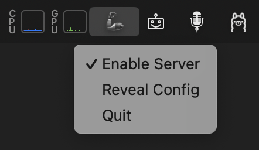

# SBMCPO: StatusBar MCP-to-OpenAPI



This tiny MacOS status bar app allows you to run an OpenAPI server that exposes access to multiple MCP ([Model Context Protocol](https://modelcontextprotocol.io/)) servers. It is intended for use with chat interfaces like [Open WebUI](https://github.com/open-webui/open-webui) that run tools via plain web requests.

It's basically a mash-up of [rumps](https://github.com/jaredks/rumps) and [mcpo](https://github.com/open-webui/mcpo). It offers a simple `sbmcpo.app` that you can double-click to launch.

## Usage

Make sure your environment is capable of running `uvx`:

```bash
uvx mcpo
```

If that shows a usage message, you should be able to run this app either on the command line:
```bash
uv run --script sbmcpo.app/MacOS/sbmcpo.py
```
or by simply double-clicking `sbmcpo.app` in Finder.


## Configuration

This app examines `~/.sbmcpo.json` for configuration. The file should contain a JSON object with the following structure (all fields but `mcpServers` are optional):

```json
{
  "port": 8000,
  "apiKey": null,
  "host": "127.0.0.1",
  "corsAllowOrigins": ["*"],
  "mcpServers": {}
}
```

The `mcpServers` field is a map of MCP server names to their details in the format used by [Claude Desktop](https://modelcontextprotocol.io/quickstart/user).

## Authors

- [Adam Smith](https://adamsmith.as/)